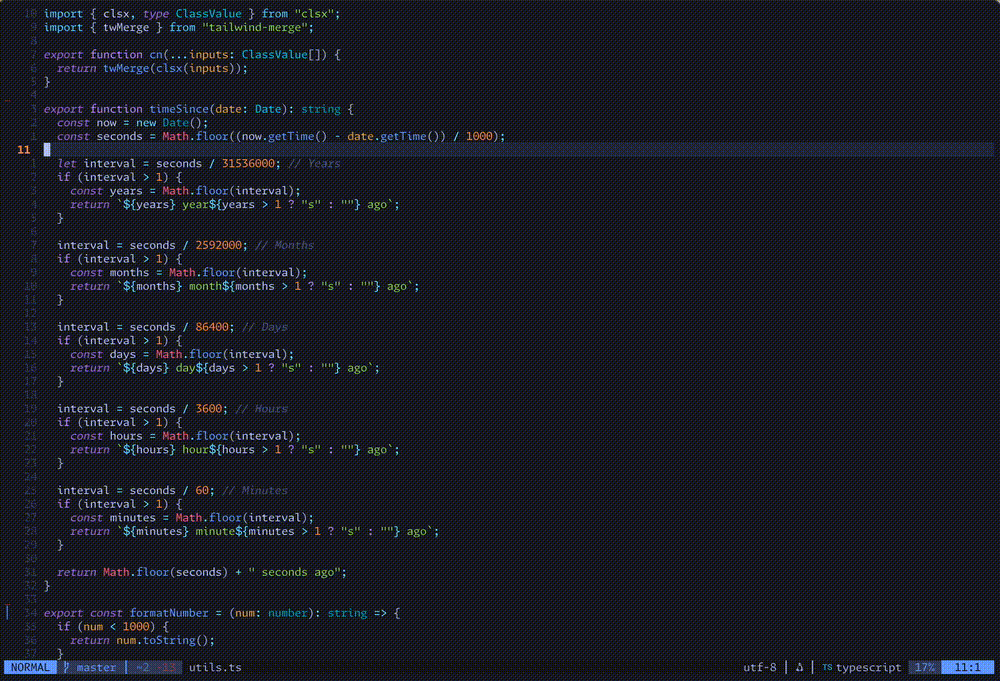

<div align="center">

# ✨ docscribe.nvim ✨

**A Neovim plugin for effortless inline documentation using Multiple Language Model Providers**


</div>

---

## 🎥 Demo



---

## ✨ What It Does

`docscribe.nvim` automatically generates professional documentation for your functions. Simply place your cursor inside any function and run `:DocscribeGenerate` to create language-appropriate docstrings that follow industry standards.

### 🎨 Language Support

| Language | Support Level | Documentation Style |
|----------|---------------|-------------------|
| JavaScript | ✅ Full | JSDoc |
| TypeScript | ✅ Full | JSDoc with types |
| C | ✅ Full | Doxygen |
| Java | 🟡 Limited | Javadoc |
| C++ | 🟡 Limited | Doxygen |
| Python | 🟡 Limited | Google style |
| Lua | 🟡 Limited | LuaDoc |

### 🔌 Multiple LLM Providers

Choose the provider that best fits your needs:

| Provider | Type | Best For |
|----------|------|----------|
| 🦙 **Ollama** | Local | Privacy & Offline Development |
| 🧠 **Google Gemini** | Cloud API | Powerful Language Models |
| ⚡ **Groq** | Cloud API | Ultra-Fast Response Times |

### 🎯 Smart Features

- **Function Detection**: Uses Tree-sitter to automatically find functions at cursor
- **Docstring Replacement**: Intelligently updates existing documentation
- **Visual Feedback**: Shows progress with spinner notifications and highlighting
- **Error Handling**: Clear error messages with actionable feedback

---

## ⚙️ Installation

### Dependencies

- **[nvim-treesitter](https://github.com/nvim-treesitter/nvim-treesitter)** - For function detection
- **[plenary.nvim](https://github.com/nvim-lua/plenary.nvim)** - For async operations

### Plugin Manager

**Lazy.nvim:**
```lua
{
  'AdrianMosnegutu/docscribe.nvim',
  dependencies = {
    'nvim-treesitter/nvim-treesitter',
    'nvim-lua/plenary.nvim',
  },
  config = function()
    require('docscribe').setup()
  end
}
```

**Packer.nvim:**
```lua
use {
  'AdrianMosnegutu/docscribe.nvim',
  requires = {
    'nvim-treesitter/nvim-treesitter',
    'nvim-lua/plenary.nvim',
  }
}
```

---

## ⚙️ Configuration

### Default Setup

```lua
require('docscribe').setup({
    ui = {
        highlight = {
            style = "signature",        -- "signature" | "full" | "none"
            timeout = 2000,             -- Highlight duration (ms)
            bg = "#545454",             -- Highlight color
        },
    },
    llm = {
        provider = "ollama",            -- "ollama" | "google" | "groq"
        provider_opts = {
            ollama = {
                model = "llama3.2",
            },
            google = {
                model = "gemini-1.5-flash",
                api_key = os.getenv("GOOGLE_API_KEY"),
            },
            groq = {
                model = "llama-3.1-8b-instant",
                api_key = os.getenv("GROQ_API_KEY"),
            },
        },
    },
})
```

### Provider Setup

#### 🦙 Ollama (Local)
```lua
llm = {
    provider = "ollama",
    provider_opts = {
        ollama = {
            model = "llama3.2",  -- Any installed Ollama model
        },
    },
}
```

**Setup Steps:**
1. Install Ollama: [ollama.ai](https://ollama.ai/)
2. Pull a model: `ollama pull llama3.2`
3. No API key required

#### 🧠 Google Gemini (Cloud)
```lua
llm = {
    provider = "google",
    provider_opts = {
        google = {
            model = "gemini-1.5-flash",
            api_key = os.getenv("GOOGLE_API_KEY"),
        },
    },
}
```

**Setup Steps:**
1. Get API key from [Google AI Studio](https://aistudio.google.com/)
2. Set environment variable `GOOGLE_API_KEY` or replace `os.getenv("GOOGLE_API_KEY")` with your key

#### ⚡ Groq (Ultra-Fast)
```lua
llm = {
    provider = "groq",
    provider_opts = {
        groq = {
            model = "llama-3.1-8b-instant",
            api_key = os.getenv("GROQ_API_KEY"),
        },
    },
}
```

**Setup Steps:**
1. Get API key from [console.groq.com](https://console.groq.com/)
2. Set environment variable `GROQ_API_KEY` or replace `os.getenv("GROQ_API_KEY")` with your key

---

## 🚀 Usage

1. **Position your cursor** inside any function
2. **Run the command**: `:DocscribeGenerate`
3. **Watch documentation appear** with proper formatting

### Example Output

**JavaScript:**
```javascript
/**
 * Calculates the total price including tax.
 * @param {number} price - The base price of the item
 * @param {number} taxRate - The tax rate as a decimal
 * @returns {number} The total price including tax
 */
function calculateTotal(price, taxRate) {
    return price * (1 + taxRate);
}
```

**C:**
```c
/**
 * Finds the maximum value in an array.
 * @param arr The array to search
 * @param size The size of the array
 * @return The maximum value found
 */
int find_max(int arr[], int size) {
    // implementation
}
```

### Custom Prompt Templates

Override default templates for specific languages:

```lua
require('docscribe').setup({
    prompt_templates = {
        python = [[
            Generate a concise Python docstring in Google style.
            Focus on Args and Returns sections.
            {{code}}
        ]],
    },
})
```

---

## 🤝 Contributing

Contributions are welcome! Please feel free to submit pull requests, report bugs, or suggest features.

### Development Setup

```bash
git clone https://github.com/AdrianMosnegutu/docscribe.nvim.git
cd docscribe.nvim

# Run tests
nvim --headless -c "PlenaryBustedDirectory tests" -c "qa!"
```

---

## 📝 License

This project is licensed under the MIT License - see the [LICENSE](./LICENSE) file for details.

---

<div align="center">

**Made with ❤️ for the Neovim community**

</div>
